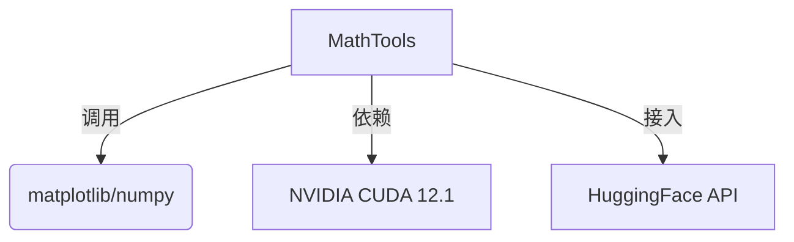
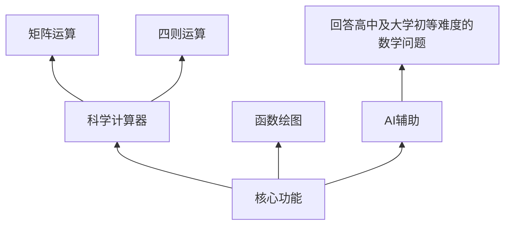

# MathTools 需求规格说明书

## 1. 引言
### 1.1 产品目的
为科研人员和学生提供跨平台科学计算工具套件，解决复杂数学运算（矩阵计算/函数绘图）、符号推导和数学问题智能求解需求。通过集成AI能力将数学问题解决效率提升。

### 1.2 产品范围
​**​包含功能​**​：
- 科学计算器（四则运算/复数运算/矩阵运算/函数运算）
- 生成一元函数图像
- AI辅助求解

​**​不包含功能​**​：
- 移动端适配（iOS/Android）
- 商业数学软件高级功能（如MATLAB Simulink）

### 1.3 术语定义
| 术语 | 定义 |
|-------|------|
| fine-tuning | 模型微调 |
| CUDA加速 | NVIDIA GPU并行计算技术 |

### 1.4 参考文献
>- IEEE 830-1998需求规范标准
>- QT Framework 6.5开发文档
>- unsloth官方手册

### 1.5 文档结构
第2章描述产品整体架构，第3章细化功能与非功能需求，附录包含接口协议和测试用例。

## 2. 产品整体描述
### 2.1 产品背景

### 2.2 产品功能

### 2.3 用户特征
- ​主要用户​​：大学本科生
- ​技术能力​​：具有一定的数学能力，根据最终版本的用户手册可以进行使用
- ​使用场景​：课程作业、论文实验数据计算
### 2.4 约束条件
- 使用QT 6.5+框架开发
- 遵循GPL-3.0开源协议
### 2.5 假设与依赖
- 适用Windows平台
- 假设用户具备一定数学知识
- 依赖HuggingFace模型服务可用性（后续打包至本地后不需要联网及huggingface访问权限）
- 需拥有python3.8+环境,并安装numpy和matplotlib库
## 3. 具体需求
### 3.1 外部接口需求
#### 3.1.1 用户界面
#### UI布局示例
- 拥有两级页面，第一级页面是导览图，点击上面的科学计算器、函数图像生成器或者AI使用三选一
- 点击第一级页面后进入第二级页面，分别实现科学计算器、函数图像生成器以及AI语言模型的功能
- 根据窗口大小对分辨率调整的功能，可以实现对各种窗口大小的适配
```python   
QWidget {
    QTabWidget {
        CalculatorTab : "科学计算器"
        PlotterTab : "函数绘图"
        AITab : "智能助手"
    }
}
```
#### 3.1.2 硬件接口
- NVIDIA GPU驱动版本 ≥535.86    
- 多显示器分辨率适配（1080p/2K）
#### 3.1.3 软件接口(待补充)
```cpp
// 矩阵运算接口示例
class MatrixSolver {
public:
    virtual Matrix EigenValue(Matrix input);
    virtual Matrix SVD_Decomposition(Matrix input);
}
```
#### 3.1.4 通信接口
HTTPS协议接入HuggingFace端点

### 3.2 功能需求
### 3.2.1 科学计算器
- 支持运算类型：常规四则运算(+,-,*,/)/矩阵运算
- 允许实数、复数
- 精度控制：
### 3.2.2 函数绘图
输入格式： 
- 只支持单一变量 `x`
- 允许常规四则运算符，括号
- 允许部分已知函数，如`sin(x)`
- 举例 `3*x+7`

正确生成图像，保存在本地
### 3.2.3 AI辅助
```json
```

### 3.3 性能需求
- 指标	要求
- 矩阵运算（1000x1000）	<2s
- 绘图渲染延迟	<500ms
- AI响应时间	<3s
### 3.4 设计约束
- 必须使用CMake构建系统
- 代码注释率 ≥50%
### 3.5 质量属性
- 可靠性：99.9%无崩溃运行
- 可维护性：模块化设计，接口文档完整率100%
- 可扩展性：支持插件机制扩展新功能
### 3.6 其他需求
- 支持中英双语界面？（最终版形成后进行）

## 4. 附录
